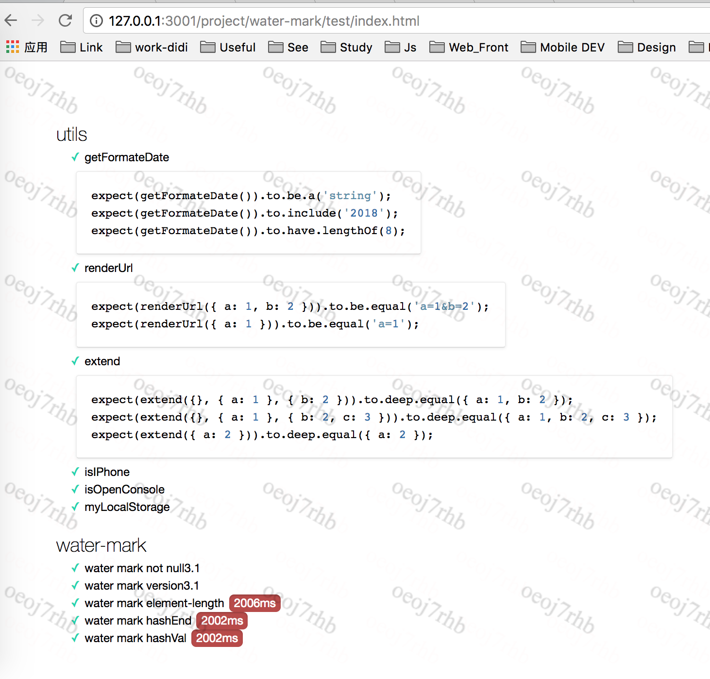

# 页面加水印

    页面水印内容标准：系统ID(me里面的系统ID) + 用户账号（me里面的账号) + unix 时间戳(年-月-日)

    水印的样式不支持自定义，默认设置有水印样式，水印是图片平铺，可以根据自己文字的长短调整图片的宽高，从而控制水印的密集程度。

    水印带有对抗功能防止用户手动修改或者删掉水印，水印默认每隔2500毫秒监测一次，可以修改间隔时间

    水印可以设置页面容器位置，默认全屏平铺显示水印

    代码同时支持设置禁止用户拷贝内容，禁止用户选择文字，禁止用户鼠标右键

## 使用

1、直接引入water-mark.js，[在线版本地址](http://sec-aegisfe.didistatic.com/static/aegisfe/water-mark1.0.js) 建议引用线上地址,方便代码升级维护

2、初始化设置，代码如下

 ```js
    //使用必须传入这三个参数
    //建议先检测waterMark 是否存在，不存在业务代码不执行，防止人为的干掉水印js文件的加载
    waterMark({
        //系统ID  me里面的系统ID
        systemId:'012',
        //邮箱前缀，me里面的账号
        userId:'xiongjian'
    })

 ```

## [具体可以查看页面demo](demo/test.html)

## 水印支持各种参数设置，以下是所有支持的参数

```js
    var defaultOpts = {
    //系统ID
    systemId: '',
    //当前用户ID 邮箱前缀
    userId: '',
    //unix时间戳 :20170606
    timestamp: '',
    //需要打水印的容器
    containerEl: document.body,
    //每次发送求情携带的数据
    data: {},
    //水印单张图片宽度
    imgWidth: 210,
    //水印单张图片高
    imgHeight: 150,
    //水印的z-index
    zIndex: 10000,
    //监视时间间隔
    time: 2500,
    //是否直接禁用掉鼠标右键Î
    disableContextMenu: false,
    //是否启用，不让其选择，默认不启用
    disableSelect: false,
    //不能选择的区域，传入一个原生dom元素
    disableSelectEl: '',
    //是否禁止拷贝
    disableCopy: false,
    //禁止复制的元素容器
    disableCopyEl: ''
    };
```

## add test

>先运行npm test构建好测试文件，然后在根路径启动静态文件服务，打开./test/index.html 运行测试用例


